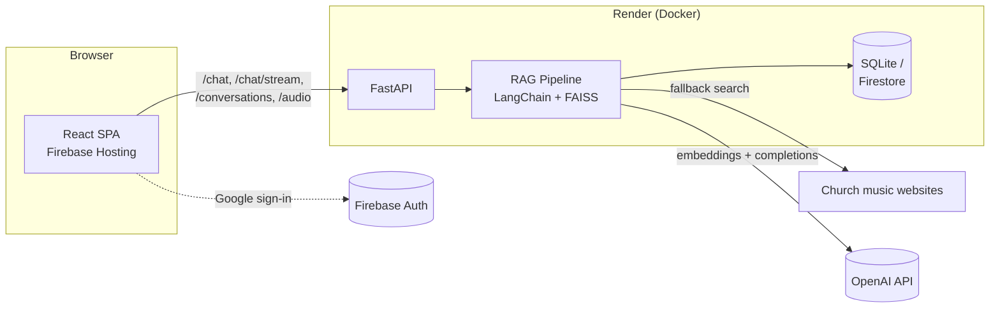

# Music Assist

A RAG-powered chat assistant for LDS Church music - hymns, conducting
guidance, music theory, and music-calling policy - grounded in official
Church resources with live web-search fallback.

## Stack

| | |
|---|---|
| **Frontend** | React 19, TypeScript, Vite, Tailwind CSS - deployed as a static site on Firebase Hosting |
| **Backend** | FastAPI, LangChain, OpenAI, FAISS - deployed as a Docker web service on Render |
| **Auth** | Firebase Authentication (Google sign-in) |
| **Conversation memory** | SQLite by default; pluggable Firestore backend (`settings.memory_backend`) |

## Architecture



`POST /chat` and `POST /chat/stream` first check for canned responses
(greetings, "how are you", hymn-audio requests - see
`backend/services/intent.py`), then fall through to the RAG pipeline: search
the local FAISS index, fall back to a live Church-website search when local
results are thin, generate an answer with GPT, and persist the exchange to
conversation memory.

## Repository layout

```
backend/    FastAPI app, RAG pipeline, routers, tests - see backend/README.md
frontend/   React app, hooks, components, tests - see frontend/README.md
firebase.json, .firebaserc   Firebase Hosting config for the frontend
```

## Getting started

Each side has its own setup instructions:

- [`backend/README.md`](backend/README.md) - Python env, `.env` setup, building
  the FAISS index, running the API, running `pytest`.
- [`frontend/README.md`](frontend/README.md) - Node env, `.env` setup, running
  the dev server, running `vitest`.

Run both together locally: start the backend on `:8080`, then the frontend
dev server on `:3000` (it points at the backend via `VITE_API_BASE_URL`).

## Testing

```bash
cd backend && pytest && ruff check .
cd frontend && npm run typecheck && npm run test && npm run build
```

Both suites run fully offline (no OpenAI/Firebase credentials required) - the
backend suite fakes the RAG pipeline via FastAPI dependency overrides
(`backend/tests/conftest.py`), and the frontend suite mocks
`services/apiService.ts` and `firebase/auth` at the module boundary.

CI (`.github/workflows/ci.yml`) runs both on every push and PR to `main`.

## Deployment

- **Frontend**: `firebase deploy` from the repo root after `npm run build` in
  `frontend/` (see `firebase.json`).
- **Backend**: Docker web service on Render (see `backend/render.yaml` and
  `backend/Dockerfile`). Required secrets (`OPENAI_API_KEY`, `ADMIN_KEY`) are
  set in the Render dashboard, not committed.
